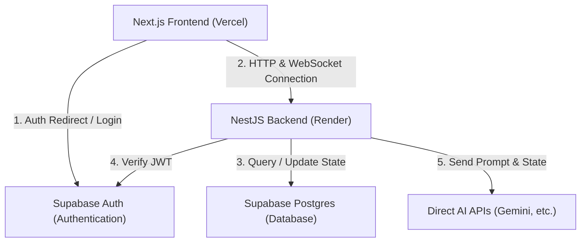
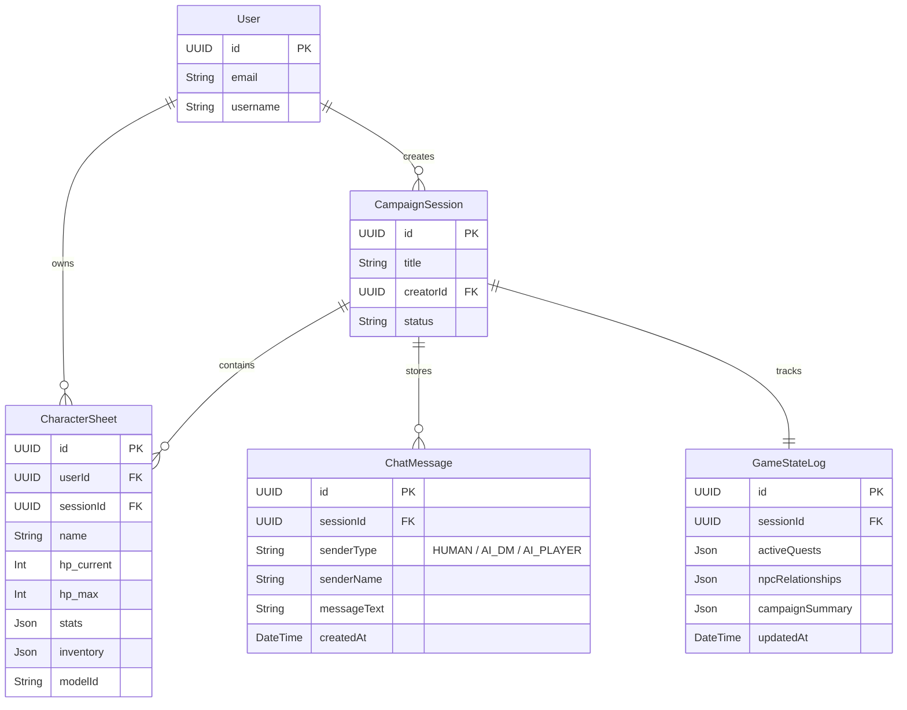

# DunDrAI — Project Implementation Plan

This document outlines the end-to-end technical plan for building DunDrAI, a real-time multiplayer D&D platform driven by AI agents and human players.

---

## 1. PROJECT BRIEF

### What we're building

DunDrAI is a real-time web platform for playing Dungeons & Dragons, supporting collaborative play between humans and AI models (such as Gemini 1.5/2.5 Flash). AI agents can act as either the Dungeon Master (DM) or fellow party members. The platform coordinates real-time text chat, session state (turn tracking), digital character sheets, and verified dice rolling into a single unified workspace.

### Target users

- **Solo Players:** D&D players who want to experience campaign play but lack a human group, using AI to fill both the DM and party member slots.
- **Small Groups:** Pre-existing human groups who want to play but lack a dedicated DM, or want to add an AI party member to fill out their table.

### Top 3 non-negotiable requirements (V1)

1.  **Real-Time Game Sessions:** Dynamic text chat, active turn management, and game status synchronization between all connected players (human or AI).
2.  **Multi-Role AI Orchestration:** Flexible AI agents playing as either the Dungeon Master or party members, using structured JSON outputs to mutate the game's state (inventory, HP, quests).
3.  **Digital Character Sheets & Verified Polyhedral Dice Roller:** Visual stats HUD and a verifiable, server-side dice-rolling system supporting standard D&D polyhedral dice (d4, d6, d8, d10, d12, d20, d100) and mathematical modifiers (e.g., 2d6 + 3) integrated directly into the chat feed.

### Top 3 explicit non-goals

1.  **Real-time Voice/Video Chat:** No WebRTC or audio streams; communication is text-only for V1.
2.  **Graphical Virtual Tabletop (VTT):** No interactive 2D grids, token movement, or visual line-of-sight maps (V2 feature).
3.  **Automated D&D 5e Rules Engine:** The platform will not strictly calculate or enforce rules like combat range or spell slot math. The DM (human or AI) will adjudicate rules via chat, identical to a physical tabletop.

---

## 2. STACK CHOICES

| Layer                     | Choice                                                  | Why this over alternatives                                                                                                                                               | Risk                                                                                                         |
| :------------------------ | :------------------------------------------------------ | :----------------------------------------------------------------------------------------------------------------------------------------------------------------------- | :----------------------------------------------------------------------------------------------------------- |
| **Frontend**              | **Next.js (App Router)**                                | Best-in-class React framework. App router enables fast page generation, server layouts, and optimized page entry points.                                                 | Hydration conflicts between Server Components and client-heavy WebSocket stores.                             |
| **Frontend Architecture** | **Feature-Sliced Design (FSD)**                         | Standardized layers (`app`, `pages`, `widgets`, `features`, `entities`, `shared`) to keep code modular, readable, and scalable.                                          | Higher initial folder layout overhead and learning curve.                                                    |
| **Backend**               | **NestJS (Modular)**                                    | Scalable, highly structured Node.js backend. Great support for WebSockets, HTTP routing, and clean dependency injection.                                                 | Circular dependency risks if real-time modules (chat, dice, game state) are split too early.                 |
| **Database**              | **Supabase (PostgreSQL)**                               | Free-tier cloud-hosted PostgreSQL database. Highly performant and supports relational schema constraints.                                                                | Direct Prisma connections bypass Supabase client-side DB features (which is intentional for NestJS control). |
| **ORM**                   | **Prisma**                                              | Type-safe Database client with automated, declarative migration workflows.                                                                                               | Performance overhead in very high-frequency real-time database write environments.                           |
| **Authentication**        | **Supabase Auth**                                       | Free, ready-to-go user auth flows. Runs client-side for rapid login, registration, and session management.                                                               | Requires custom auth guards in NestJS to verify Supabase JWTs.                                               |
| **Client State**          | **Zustand**                                             | Lightweight client state manager. Easily updated from Socket.io event listeners outside of React rendering cycles.                                                       | Hydration mismatch warnings if Zustand state is rendered before client mounts.                               |
| **Hosting**               | **Vercel** (Frontend) + **Render** (Backend)            | Vercel optimizes Next.js; Render supports persistent Docker/Node instances required for active WebSockets.                                                               | Render's free tier sleeps after 15m of inactivity, creating a 50-second wake-up lag.                         |
| **CI/CD**                 | **GitHub Actions**                                      | Built-in Git platform pipelines for linting, running unit tests, and checking compilation before auto-deploying.                                                         | Setup overhead in managing secrets and test databases.                                                       |
| **Testing Strategy**      | **Jest** (NestJS) + **React Testing Library** (Next.js) | Standard TypeScript testing stack. Guarantees business logic and UI component rendering integrity.                                                                       | High-frequency code updates may break tests if mock coverage is too rigid.                                   |
| **AI Integration**        | **Direct Provider SDKs (Gemini, Claude, etc.)**         | Direct connection to official APIs (starting with Gemini API via `@google/genai` and extending to other models). Allows using native features and avoids middleman fees. | Managing multiple SDKs and API keys in code.                                                                 |

---

## 3. PROJECT STRUCTURE

Monorepo folder tree organizing both frontend and backend under npm/yarn workspaces:

```text
├── apps/
│   ├── frontend/                 # Next.js application (using FSD inside /src)
│   │   ├── src/
│   │   │   ├── app/              # Next.js App Router folders, layout wrappers, and routes
│   │   │   ├── pages/            # Page-level compositions (e.g., LobbyPage, SessionPage)
│   │   │   ├── widgets/          # Major layout pieces (e.g., LiveChatRoom, CharacterHUD)
│   │   │   ├── features/         # Interactive features (e.g., DiceRoller, SendMessageField)
│   │   │   ├── entities/         # Business domain entities (e.g., CharacterModel, SessionModel)
│   │   │   └── shared/           # Core UI kits, Zustand stores, and base HTTP/WS client instances
│   ├── backend/                  # NestJS server application
│   │   ├── src/
│   │   │   ├── auth/             # Custom NestJS guards & strategies to decode Supabase JWTs
│   │   │   ├── user/             # User profile and D&D character sheet database management
│   │   │   ├── game-session/     # Socket.io Gateway, active session room managers, and dice validation
│   │   │   ├── ai/               # AI prompts, Gemini client, and structured JSON parser
│   │   │   └── prisma/           # Database module initializing Prisma Client connections
├── packages/
│   ├── shared/                   # Shared TypeScript models and Zod validation schemas
│   │   ├── src/
│   │   │   ├── types.ts          # Shared WebSocket events, User, and Session interfaces
│   │   │   └── validation.ts     # Zod schemas (e.g., CreateLobbySchema, CharacterSheetSchema
```

---

## 4. KEY ARCHITECTURE DECISIONS (ADRs)

### ADR 1: Next-to-Nest Communication Model

- **Decision:** Use REST HTTP for static, out-of-game setup actions (creating lobbies, updating profiles, logging out) and WebSockets (Socket.io) for all active game-loop actions (typing messages, triggering rolls, turn passes).
- **Context:** D&D sessions require immediate sync. HTTP polling is too slow and database-intensive.
- **Options Considered:**
  - _Option A:_ REST HTTP endpoints for every action + WebSockets for subscription broadcasts.
  - _Option B:_ Unified WebSockets using Socket.io Acknowledgements (Request-Response mode).
- **Chosen Option:** Unified WebSockets with Socket.io Acknowledgements.
- **Tradeoff:** Socket.io lacks standard HTTP response headers (like `400 Bad Request`). We accept this by standardizing an acknowledgement callback pattern on the client: `socket.emit('event', data, (response) => { ... })`.

### ADR 2: WebSocket Authentication Handshake

- **Decision:** Authenticate players w)hen they first establish a WebSocket connection by passing their Supabase Access Token (JWT) in the Socket.io `auth` handshake configuration.
- **Context:** NestJS must verify the identity of the player connecting via WebSockets to prevent room spoofing.
- **Options Considered:**
  - _Option A:_ Send tokens as query params on every WebSocket connection.
  - _Option B:_ Authenticate inside the WebSocket `auth` handshake header.
- **Chosen Option:** Handshake authentication (Option B).
- **Tradeoff:** If the user's Supabase session expires mid-game, the WebSocket will disconnect. The client must listen to disconnect events and re-establish connection using a refreshed JWT token.

### ADR 3: Zod Dual-End Validation

- **Decision:** Define all validation rules inside Zod schemas in `/packages/shared`. Next.js uses them for client-side form validation, and NestJS uses them to parse incoming WebSocket payloads.
- **Context:** Duplicate schemas on frontend and backend lead to desynced API contracts and bugs.
- **Options Considered:**
  - _Option A:_ Duplicate validations (Next.js inputs vs. NestJS class-validator models).
  - _Option B:_ Share Zod schemas via monorepo package.
- **Chosen Option:** Shared Zod schemas (Option B).
- **Tradeoff:** Adds compilation overhead in monorepo workspaces, but guarantees absolute contract validation safety.

### ADR 4: AI Campaign Memory and Direct Provider SDK Integration

- **Decision:** Maintain a structured `GameStateLog` table in PostgreSQL (tracking active quest logs, known NPCs, and player inventories). We will integrate directly with provider APIs (starting with Google Gemini API via official SDK, with the design open to adding Anthropic Claude or OpenAI directly). Each character sheet will specify their model provider and name (e.g., `provider: "google", model: "gemini-2.5-flash"`). We will encapsulate this in a unified backend `AIService` that handles direct requests to each provider and returns clean, validated JSON schemas.
- **Context:** While a proxy like OpenRouter simplifies setup, direct SDK integrations give us faster latency, better security (no third-party proxy), native JSON-mode features, and full access to generous developer free tiers (like Google's AI Studio free tier).
- **Options Considered:**
  - _Option A:_ Integrate individual vendor SDKs directly via a unified `AIService` wrapper.
  - _Option B:_ Use OpenRouter as a single API proxy to route requests to any model.
- **Chosen Option:** Option A.
- **Tradeoff:** Adds minor code complexity to support multiple SDK classes in our backend, but eliminates proxy dependencies, reduces latency, and unlocks native Gemini feature sets.

### ADR 5: Deployment Topology

- **Decision:** Next.js on Vercel, NestJS on Render (Persistent Web Service container), Supabase PostgreSQL.
- **Context:** V1 needs to be low-cost, scalable, and support WebSockets.
- **Options Considered:**
  - _Option A:_ VPS (DigitalOcean droplet) running Docker Compose.
  - _Option B:_ PaaS cloud architecture (Vercel + Render + Supabase).
- **Chosen Option:** PaaS cloud architecture (Option B).
- **Tradeoff:** Render's free tier has a cold-start sleep delay. The frontend must display a friendly "Waking up server..." loading UI when the connection is initially pending.

### ADR 6: WebSocket Reconnection and Chat Cache State Recovery

- **Decision:** Use Zustand client-side persistence (bound to `sessionStorage` for the active game session) and enable Socket.io's built-in **Connection State Recovery** on the NestJS server.
- **Context:** Brief mobile or Wi-Fi drops shouldn't clear chat history, reset scroll positions, or erase text the user is currently typing.
- **Options Considered:**
  - _Option A:_ Fetch the entire chat log history from the DB on every reconnect.
  - _Option B:_ Session storage chat cache + Socket.io Connection State Recovery + fetching missed messages by last-received timestamp.
- **Chosen Option:** Option B.
- **Tradeoff:** Next.js state components for the message input box are kept in React state, which naturally persists as long as the page is not refreshed. On reconnect, we query only the messages created _after_ the latest message timestamp in local storage to fill the gap.

### ADR 7: Render Free-Tier Server Wakeup and Wait Room UX

- **Decision:** Trigger a background `fetch()` to the NestJS `/health` endpoint inside the root Next.js home page `useEffect`. If the user attempts to enter a lobby before the server is awake, redirect them to a dedicated **"Waking up the Tavern" Waiting Room** page that displays a themed loading animation and polls `/health` until it returns `200 OK`.
- **Context:** Render's free tier spins down after 15 minutes of inactivity, resulting in a ~50-second wake-up time.
- **Options Considered:**
  - _Option A:_ Let the socket fail to connect and display a generic error message.
  - _Option B:_ Pre-emptive HTTP ping on homepage load + dedicated themed Wait Room page.
- **Chosen Option:** Option B.
- **Tradeoff:** Adds minor loading screen design overhead, but greatly improves the user experience by setting appropriate expectations.

### ADR 8: Supabase User Lazy-Creation in Postgres

- **Decision:** Implement **Lazy-Creation** inside a NestJS interceptor or guard. When a verified Supabase JWT is received, check if the corresponding UUID exists in the Prisma `User` table; if not, dynamically insert a new user record.
- **Context:** We need a matching user record in PostgreSQL to establish foreign-key relationships for characters and campaigns.
- **Options Considered:**
  - \_Option A:\* Supabase Database Webhooks calling a public NestJS endpoint.
  - \_Option B:\* Backend lazy-creation of the user record upon the first authenticated request (REST or WebSocket).
- **Chosen Option:** Backend lazy-creation (Option B).
- **Tradeoff:** Adds a single lightweight DB check to the authentication guard, but completely eliminates the need for exposing webhook endpoints and managing webhook secret keys.

---

## 5. DIAGRAMS

### A. System Component Diagram



### B. Sequence Diagram: Player Roll & AI DM Narration

```mermaid
sequenceDiagram
    autonumber
    actor Player as Player (Next.js)
    participant Server as NestJS Server
    participant DB as Postgres (Supabase)
    participant AI as AI Providers (Gemini, etc.)

    Player->>Server: WebSocket: Roll Dice Event
    Note over Server: Server rolls polyhedral dice, validates formula
    Server->>DB: Write Roll Event to Chat Log
    Server->>Player: Broadcast Roll Result

    Note over Server: Evaluate turn; AI DM must react
    Server->>DB: Fetch Active Game Log + Character Sheets + Chat
    Server->>AI: Send Prompt with Context and Roll Result
    AI-->>Server: Return Narrative Chat + State JSON Update

    Server->>DB: Update character inventory
    Server->>DB: Write AI Narrative Chat to Chat Log
    Server->>Player: Broadcast AI Message and update HUD
```

### C. Entity-Relationship Diagram (Database)



---

## 6. MENTOR DISCUSSION NOTES & NEXT STEPS

All initial open questions have been resolved and codified into the architectural decisions. We are ready to begin project execution.
